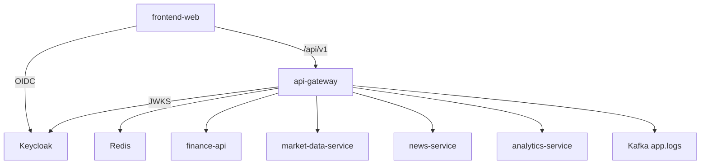
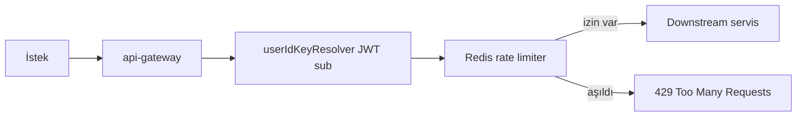
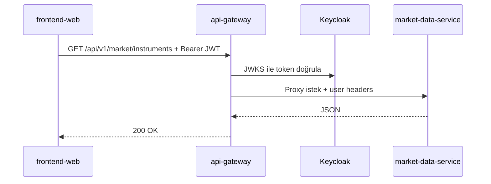
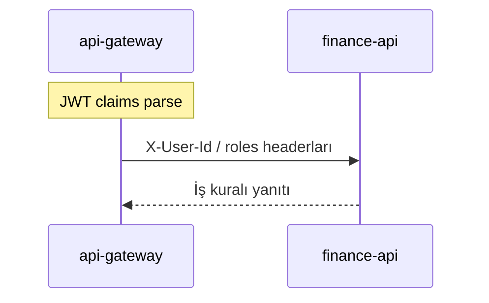

# api-gateway

## Özet

**api-gateway**, tarayıcı ve harici istemcilerin platform backend’ine ulaştığı **tek HTTP giriş noktasıdır**. JWT doğrulama (Keycloak JWKS), CORS, Redis tabanlı rate limiting, Resilience4j circuit breaker ve path’e göre downstream mikroservis yönlendirmesini yapar. OpenAPI/Swagger dokümantasyonunu tek arayüzde birleştirir.

## Sorumluluklar

- `/api/v1/**` ve `/health` isteklerini doğru downstream servise yönlendirmek
- OAuth2 Resource Server ile JWT doğrulamak; kullanıcı kimliğini downstream header’lara aktarmak
- Kullanıcı başına API rate limiting (Redis)
- Market, news ve analytics için circuit breaker ve fallback endpoint’leri
- Birleşik Swagger UI (`/swagger-ui.html`) ve servis OpenAPI proxy rotaları
- Yapılandırılmış logları Kafka `app.logs` topic’ine göndermek (Log4j2)

## Sorumluluk dışı

- Portföy, alarm, piyasa verisi gibi **iş kuralları** — `finance-api` ve uzman servisler
- Kullanıcı kaydı / MFA — `finance-api` + Keycloak
- E-posta gönderimi — `notification-service`
- Log indeksleme — `log-consumer-service`

## Yapılabilecekler

| Perspektif | Yetenek |
|------------|---------|
| Portal / SPA | Tüm `/api/v1` çağrılarını tek origin üzerinden yapmak |
| Geliştirici | Swagger ile tüm servis API’lerini keşfetmek |
| Operasyon | Prometheus `/actuator/prometheus`, health, Jaeger trace |
| Hata toleransı | CB açıkken `/fallback/market`, `/fallback/news`, `/fallback/analytics` |

## Çalışma ortamı

| Özellik | Değer |
|---------|-------|
| Maven modülü | `api-gateway` |
| Container adı | `api-gateway` |
| HTTP port (Docker) | **8080** (host map) |
| HTTP port (yerel `dev`) | **9090** |
| Spring profilleri | `docker` (compose), `dev` (IDE) |
| Healthcheck | `/actuator/health` |

## Bağımlılıklar

| Bileşen | Kullanım |
|---------|----------|
| PostgreSQL | Hayır |
| Redis | Rate limiter state |
| Kafka | Log append (`app.logs`) |
| Keycloak | JWT issuer / JWKS |
| HTTP downstream | finance-api, market-data-service, news-service, analytics-service (+ notification/log URI tanımlı, çoğunlukla internal) |

Downstream URI’ler: `gateway.services.*` — [`application.yml`](../../../api-gateway/src/main/resources/application.yml).

## Bağlam diyagramı



## HTTP veri akışları

### Rate limiting



### Route özeti (order düşük = önce)

| Order | Path öneki | Hedef |
|-------|------------|-------|
| -14 | `/api/v1/market/eurobonds/tr/**` | finance-api |
| -13 | `/api/v1/market/overview`, `.../insights` | finance-api |
| -12 | `/api/v1/rates/**` | market-data-service |
| -11 | `/api/v1/news/enriched/**`, `.../favorites/**` | finance-api |
| -10 | `/api/v1/news/**` | news-service |
| -8 | `/api/v1/market/**` | market-data-service |
| -6 | `/api/v1/analytics/**` | analytics-service |
| -3 | `/api/v1/**`, `/health` | finance-api (rate limit + CB) |
| -2 | `/api/v1/public/**` | finance-api |

Kaynak: [`GatewayRoutesConfig.java`](../../../api-gateway/src/main/java/com/company/gateway/bootstrap/config/GatewayRoutesConfig.java). Tam tablo: [api.md](../api.md).

### Piyasa listesi isteği



### JWT ve kullanıcı bağlamı



Gateway `gateway.user-context.*` ile `sub`, `preferred_username`, `realm_access.roles` claim’lerini header’a map eder.

## Kafka / olay akışları

| Topic | Rol | Açıklama |
|-------|-----|----------|
| `app.logs` | Üretir | Log4j2 JSON; tüketim `log-consumer-service` |

Gateway iş domain event’i üretmez.

## Zamanlayıcılar / arka plan işleri

Yok — tamamen istek güdümlü (reactive gateway).

## Veri modeli

Kalıcı veritabanı kullanmaz. Redis yalnızca rate limit bucket’ları içindir.

## Paket / kod yapısı

```
api-gateway/src/main/java/com/company/gateway/
├── bootstrap/config/     # GatewayRoutesConfig, security, rate limit
├── fallback/             # Circuit breaker fallback controller'lar
└── ...
```

## Yapılandırma

| Değişken | Açıklama |
|----------|----------|
| `JWT_ISSUER_URI` | Token issuer (ör. `http://localhost:8085/realms/finance`) |
| `FINANCE_BASE_URI` | finance-api downstream |
| `MARKET_BASE_URI` | market-data-service |
| `NEWS_BASE_URI` | news-service |
| `ANALYTICS_BASE_URI` | analytics-service |
| `SPRING_DATA_REDIS_HOST` | Rate limiter Redis |
| `GATEWAY_CORS_ALLOWED_ORIGINS` | SPA origin (varsayılan `http://localhost:5173`) |
| `TRACING_SAMPLE_PROBABILITY` | Trace örnekleme (varsayılan 0.1) |

Tam liste: [configuration.md](../configuration.md).

## Gözlemlenebilirlik

| Kanal | Detay |
|-------|-------|
| Loglar | `app.logs`; `correlationId` MDC |
| Metrikler | Prometheus job `api-gateway` |
| Trace | OTLP → `http://jaeger:4318/v1/traces` |

Ayrıntı: [observability.md](../observability.md).

## Yerel çalıştırma

```bash
mvn -pl api-gateway -am spring-boot:run -Dspring-boot.run.profiles=dev
```

Port **9090**. Downstream servislerin yerel URI’leri: [`application-dev.yml`](../../../api-gateway/src/main/resources/application-dev.yml).

Kurulum: [getting-started.md](../getting-started.md) · Geliştirme: [development.md](../development.md).

## İlgili belgeler

| Belge | İçerik |
|-------|--------|
| [api.md](../api.md) | Route listesi ve Swagger |
| [finance-api.md](finance-api.md) | Varsayılan catch-all hedef |
| [architecture.md](../architecture.md) | Platform mimarisi |
| [services.md](../services.md) | Port özeti |
