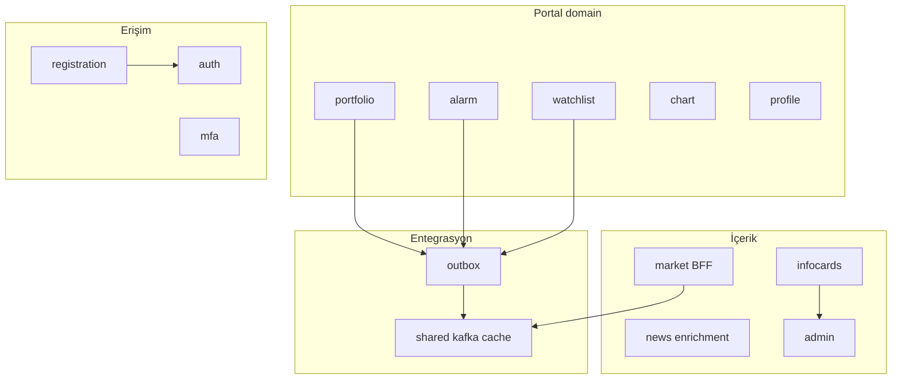
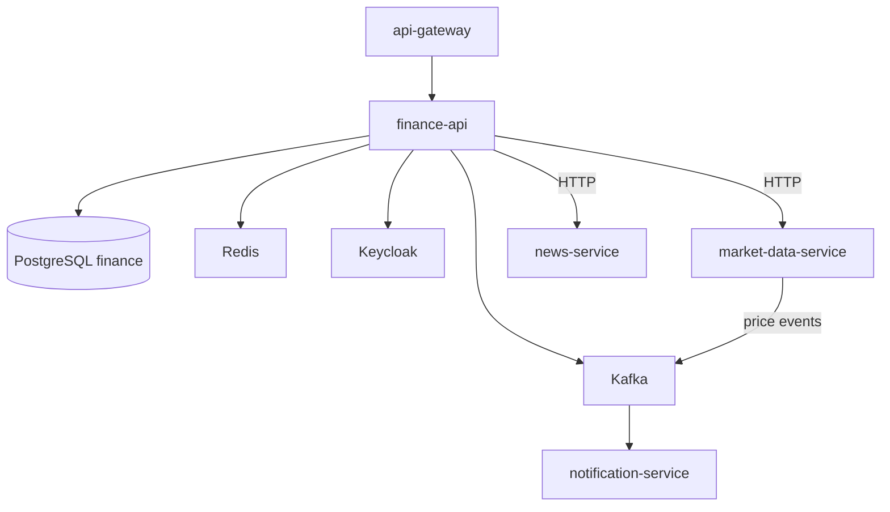
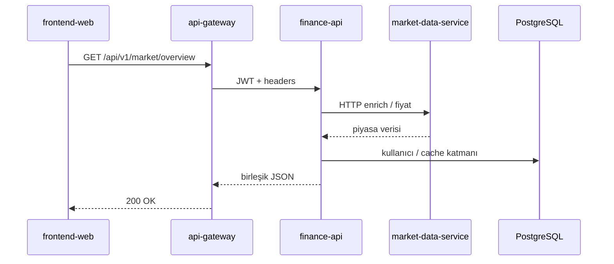
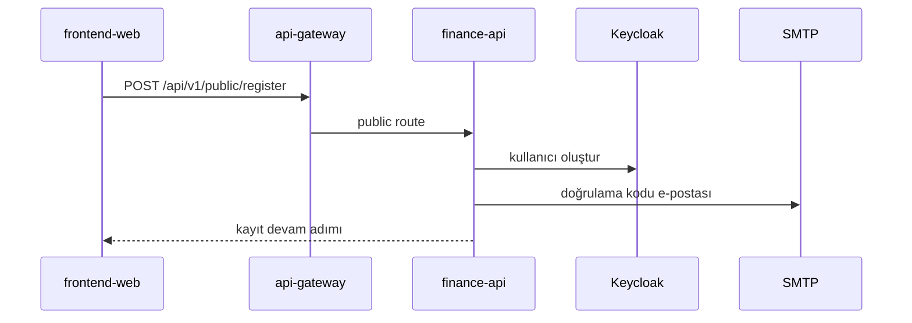
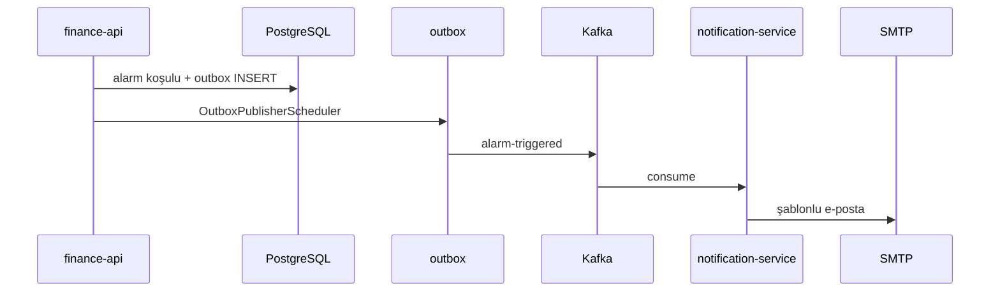

# finance-api

## Özet

**finance-api**, 32 Bit Finance Portal’ın **Backend-for-Frontend (BFF)** ve iş kuralı merkezidir. Kullanıcıya özel veriler (portföy, işlem, alarm, izleme listesi, profil), kayıt/MFA, admin KPI’ları, bilgi kartları ve haber zengiştirme burada yaşar. Piyasa ham verisi için `market-data-service`’e HTTP veya Kafka ile bağlanır; domain olaylarını transactional outbox ile Kafka’ya yazar.

## Sorumluluklar

- Portföy, işlem geçmişi, hedefler, harici portföy görünümü
- Fiyat alarmları ve alarm geçmişi
- İzleme listesi ve grafik çizim kayıtları
- Kayıt, e-posta doğrulama, TOTP MFA, güvenilir cihaz
- Profil, avatar, bildirim tercihleri
- Admin portal metrikleri, bilgi kartları (CRUD + AI içerik)
- Haber favorileri ve zenginleştirilmiş haber API’leri
- Piyasa özeti / insight BFF (`/api/v1/market/overview`, eurobond TR proxy)
- Keycloak Admin API ile kullanıcı/rol yönetimi
- Kafka consumer: canlı fiyat / FX / fon snapshot olayları
- Kafka producer (outbox): alarm, watchlist, login güvenlik, işlem olayları

## Sorumluluk dışı

- Ham piyasa kataloğu ve EVDS scheduler — `market-data-service`
- RSS ingestion ve ham haber listesi — `news-service` (BFF zenginleştirme burada)
- RSI / teknik gösterge hesaplama — `analytics-service`
- E-posta SMTP gönderimi — `notification-service`
- Merkezi log indeksleme — `log-consumer-service`
- JWT edge doğrulama — `api-gateway`

## Yapılabilecekler

| Perspektif | Yetenek |
|------------|---------|
| Portal kullanıcısı | Portföy yönetimi, alarm kurma, izleme listesi, profil/MFA |
| Admin | KPI panoları, bilgi kartı yönetimi, engelli e-postalar |
| Public (anonim) | Kayıt, giriş tamamlama, public health |
| Sistem | Kafka ile fiyat cache güncelleme; outbox ile bildirim tetikleme |

## Çalışma ortamı

| Özellik | Değer |
|---------|-------|
| Maven modülü | `finance-api` |
| Container adı | `finance-api` |
| HTTP port | **8080** (internal; dış dünya gateway üzerinden) |
| Spring profilleri (Docker) | `docker`, `kafka`, `cache-redis` |
| Spring profilleri (yerel) | `dev`, `kafka` |
| Healthcheck | `/actuator/health` (start period ~120s) |

## Domain modül etkileşimi



## Bağımlılıklar

| Bileşen | Kullanım |
|---------|----------|
| PostgreSQL | `finance` DB, Flyway `finance_flyway_schema_history` |
| Redis | `cache-redis` profili — instrument fiyat önbelleği |
| Kafka | Outbox publish + market event consume |
| Keycloak | Admin API, JWT resource server |
| HTTP | `market-data-service`, `news-service` |
| Dosya sistemi | `photos/{userId}/` avatar storage |

## Bağlam diyagramı



## HTTP veri akışları

### Önemli controller grupları

| Alan | Controller (örnek) | Path öneki |
|------|---------------------|------------|
| Public auth | `PublicRegistrationController`, `PublicAuthenticationController` | `/api/v1/public/**` |
| Portföy | `PortfolioController`, `TradeController`, `TransactionHistoryController` | `/api/v1/portfolio/**` |
| Alarm | `AlarmController`, `AlarmHistoryController` | `/api/v1/alarms/**` |
| İzleme / grafik | `WatchlistController`, `ChartController`, `ChartDrawingSaveController` | `/api/v1/watchlist/**`, chart |
| Piyasa BFF | `MarketOverviewController`, `MarketDataProxyController`, `MarketTurkeyEurobondController` | `/api/v1/market/overview`, proxy |
| Haber | `NewsAggregationController`, `NewsFavoriteController` | `/api/v1/news/enriched/**`, favorites |
| Profil / MFA | `PortalProfileController`, `PortalMfaController`, `PortalTrustedDevicesController` | `/api/v1/profile/**`, mfa |
| Admin | `AdminPortalMetricsController`, `AdminInfoCardsController` | `/api/v1/admin/**` |
| Bilgi kartları (portal) | `PortalInfoCardsController` | `/api/v1/info-cards/**` |
| AI | `AdminInfoCardAiController` | admin AI içerik |

### Piyasa özeti (BFF + MDS)



### Kayıt ve e-posta doğrulama



## Kafka / olay akışları

### Üretilen topic’ler (transactional outbox)

Kaynak: [`KafkaTopics.java`](../../../finance-api/src/main/java/com/company/finance_api/shared/kafka/KafkaTopics.java). `OutboxPublisherScheduler` pending outbox satırlarını publish eder.

| Topic | Tetikleyici (ör.) | Tüketici |
|-------|-------------------|----------|
| `alarm-triggered` | Fiyat alarmı koşulu | notification-service |
| `watchlist.item.added` | İzleme listesine ekleme | notification-service |
| `watchlist.item.removed` | İzleme listesinden çıkarma | notification-service |
| `login-security.alert` | Şüpheli giriş | notification-service |
| `transaction-executed` | İşlem kaydı | (domain / bildirim) |
| `internal.user.delete.requested` | Kullanıcı silme saga | internal |

### Tüketilen topic’ler

Kaynak: `shared/messaging/kafka/consumer/`, `MarketDataTopics` (MDS ile paylaşılan adlar).

| Topic | Üreten | Amaç |
|-------|--------|------|
| `market.price.updated` | market-data-service | Fiyat cache / portal güncellemesi |
| `market.fx.snapshot.updated` | market-data-service | Döviz snapshot |
| `market.fund.snapshot.updated` | market-data-service | Fon NAV snapshot |

### Alarm → e-posta



## Zamanlayıcılar / arka plan işleri

| Bileşen | Görev |
|---------|-------|
| `OutboxPublisherScheduler` | Outbox → Kafka |
| `market-price` scheduler (dev yapılandırması) | Yerel fiyat poll (profil bağımlı) |
| Domain scheduler’lar | Alarm değerlendirme, admin snapshot vb. (paket `infrastructure/scheduler`) |

## Veri modeli

| Öğe | Değer |
|-----|-------|
| Flyway | `finance-api/src/main/resources/db/migration/V*.sql` |
| History tablosu | `finance_flyway_schema_history` |
| Ana kavramlar | `users`, portföy/işlem, `alarms`, `watchlist`, `chart_drawing_saves`, `info_cards`, admin metrik tabloları, registration doğrulama |

Tek PostgreSQL instance’ında `finance` veritabanı; Keycloak ayrı `keycloak` DB — [architecture.md](../architecture.md).

## Paket / kod yapısı

Domain-driven paketler (`com.company.finance_api`):

| Paket | Sorumluluk |
|-------|------------|
| `portfolio` | Portföy, işlem, hedef, harici portföy, değerleme |
| `alarm` | Fiyat alarmları |
| `watchlist` | İzleme listesi |
| `chart` | Grafik çizim kayıtları |
| `registration` / `auth` / `mfa` | Kayıt, giriş, TOTP |
| `profile` | Profil, avatar |
| `infocards` / `admin` | Bilgi kartları, KPI |
| `market` | Overview, MDS proxy, eurobond |
| `news` | Haber zenginleştirme, favoriler |
| `ai` | OpenAI admin içerik |
| `outbox` | Transactional outbox |
| `shared` | Security, cache, messaging, web |

Katman: `domain/` → `application/` → `infrastructure/http|persistence|scheduler/`.

## Yapılandırma

| Değişken | Açıklama |
|----------|----------|
| `SPRING_DATASOURCE_URL` | PostgreSQL (yerel: `localhost:5432`) |
| `KAFKA_BOOTSTRAP_SERVERS` | Kafka broker |
| `CLIENTS_MARKET_DATA_BASE_URL` | MDS HTTP (yerel: `http://localhost:8082`) |
| `CLIENTS_NEWS_BASE_URL` | news-service HTTP |
| `JWT_ISSUER_URI` / `JWT_JWK_SET_URI` | Keycloak |
| `APP_MFA_ENCRYPTION_SECRET` | TOTP şifreleme |
| `OPENAI_API_KEY` | Bilgi kartı AI |
| `PROFILE_AVATAR_STORAGE_ROOT` | Avatar dizini (`/photos` Docker) |
| `APP_SECURITY_ALLOW_HEADER_USER_FALLBACK` | Dev header auth (prod: false) |

Tam liste: [configuration.md](../configuration.md).

## Gözlemlenebilirlik

| Kanal | Detay |
|-------|-------|
| Loglar | `app.logs`; `traceId`, `correlationId` |
| Metrikler | Prometheus job `finance-api` |
| Trace | OTLP → Jaeger; Kafka listener observation |

Ayrıntı: [observability.md](../observability.md).

## Yerel çalıştırma

```bash
export SPRING_DATASOURCE_URL=jdbc:postgresql://localhost:5432/finance
export JWT_ISSUER_URI=http://localhost:8085/realms/finance
export KAFKA_BOOTSTRAP_SERVERS=localhost:9092
export CLIENTS_MARKET_DATA_BASE_URL=http://localhost:8082

mvn -pl finance-api -am spring-boot:run -Dspring-boot.run.profiles=dev,kafka
```

Kurulum: [getting-started.md](../getting-started.md) · Geliştirme: [development.md](../development.md).

## İlgili belgeler

| Belge | İçerik |
|-------|--------|
| [api-gateway.md](api-gateway.md) | Giriş noktası |
| [market-data-service.md](market-data-service.md) | Piyasa verisi kaynağı |
| [notification-service.md](notification-service.md) | Outbox tüketicisi |
| [api.md](../api.md) | Gateway route |
| [architecture.md](../architecture.md) | Platform Kafka özeti |
