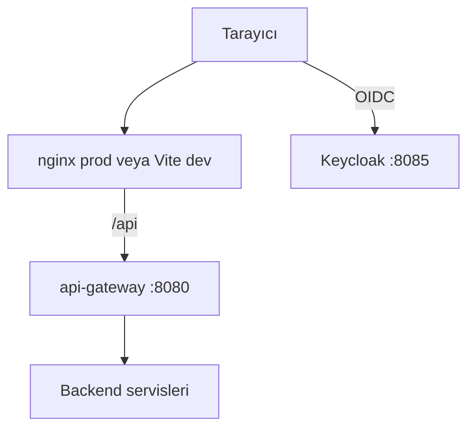
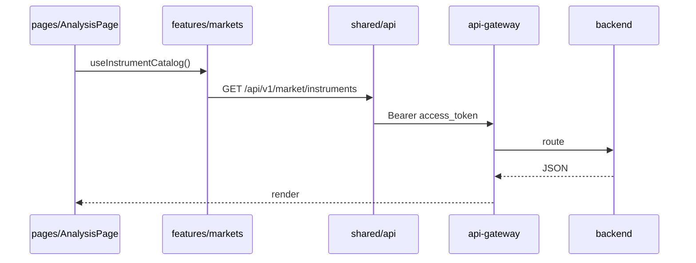
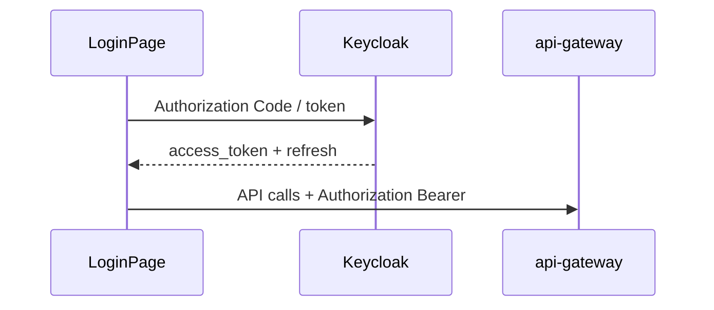
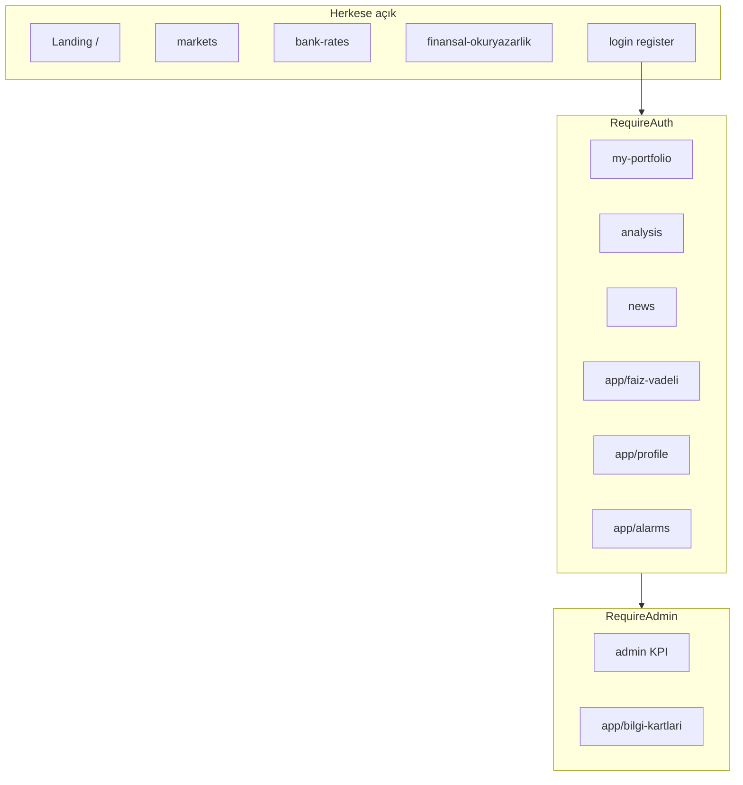

# frontend-web

## Özet

**frontend-web**, 32 Bit Finance Portal’ın **React 19** tabanlı tek sayfa uygulamasıdır (Vite 8, TypeScript). Kullanıcı arayüzü, Keycloak OIDC ile kimlik doğrulama, TR/EN/DE çoklu dil ve tüm backend çağrılarını `api-gateway` üzerinden yapar. Kalıcı iş verisi sunucudadır; tarayıcıda Zustand ile oturum/portföy state yönetilir.

## Sorumluluklar

- Landing, piyasalar, analiz, haberler, banka kurları, finansal okuryazarlık sayfaları
- Oturumlu alanlar: portföy, faiz/vadeli, dashboard, profil, alarmlar, bildirimler
- Admin KPI panoları ve bilgi kartları yönetimi (ADMIN rolü)
- Keycloak ile login / register / token yenileme
- Vite dev proxy veya `VITE_API_BASE_URL` ile API yönlendirme
- i18n (`i18next`) ve tema tercihleri

## Sorumluluk dışı

- İş kuralları ve veritabanı — backend servisleri
- JWT imzalama — Keycloak
- Piyasa verisi çekme — `market-data-service`
- E-posta — `notification-service`

## Yapılabilecekler

| Perspektif | Yetenek |
|------------|---------|
| Ziyaretçi | Landing, piyasalar, banka kurları, finansal okuryazarlık (oturumsuz) |
| Kullanıcı (`user1`) | Portföy, analiz, haber, alarm, profil, MFA |
| Admin (`admin1`) | `/admin/**` KPI, `/app/bilgi-kartlari` yönetimi |
| Geliştirici | HMR (`npm run dev`), ESLint, Vite proxy modları |

## Çalışma ortamı

| Özellik | Değer |
|---------|-------|
| Paket | `frontend-web` |
| Container (varsayılan prod) | `frontend-web` — nginx, port **5173** → container 80 |
| Container (HMR) | `frontend-web-dev` — profil `dev`, port **5174** |
| Dockerfile prod | [`Dockerfile`](../../../frontend-web/Dockerfile) — `npm run build` + nginx |
| Dockerfile dev | [`Dockerfile.dev`](../../../frontend-web/Dockerfile.dev) — Vite dev server |
| Yerel build | `npm run build` → `dist/` |
| API (Docker prod) | Same-origin `/api` → nginx `proxy_pass` → api-gateway |
| API (Docker dev profil) | `VITE_PROXY_TARGET=http://api-gateway:8080`, `VITE_DEV_PROXY_GATEWAY=true` |

## Bağımlılıklar

| Bileşen | Kullanım |
|---------|----------|
| api-gateway | Tüm `/api/v1` HTTP |
| Keycloak | OIDC (realm `finance`, port 8085) |
| PostgreSQL / Kafka | Hayır (doğrudan) |

## Bağlam diyagramı



## HTTP veri akışları

### Vite proxy modları

| Mod | Ortam | Davranış |
|-----|-------|----------|
| Prod (Docker varsayılan) | nginx :5173 | Statik SPA; `/api` → gateway |
| Gateway dev (Docker `--profile dev`) | `VITE_DEV_PROXY_GATEWAY=true` | Vite :5174, tüm `/api` → gateway |
| BFF (yerel) | varsayılan | `/api` → finance-api:8080 |
| Uzak API | `VITE_API_BASE_URL` (build-time prod) | Doğrudan host |

Detay: [api.md](../api.md) · [development.md](../development.md).

### Sayfa → API



### Login akışı



## Kafka / olay akışları

Uygulanmaz — frontend Kafka veya doğrudan OpenSearch kullanmaz. Log ve olaylar backend üzerinden akar.

## Zamanlayıcılar / arka plan işleri

Tarayıcı tarafında periyodik poll’lar sayfa hook’larında (ör. piyasa pulse, haber yenileme); sunucu scheduler değildir.

## Veri modeli

Uygulanmaz — UI state:

| Katman | Teknoloji |
|--------|-----------|
| Global store | Zustand (`app/store`, `features/`) |
| Sunucu state | REST API yanıtları (cache hook içi) |
| Tercihler | `AppPreferencesContext`, localStorage |

## Rota haritası

### Erişim seviyeleri



Kaynak: [`app/router/index.tsx`](../../../frontend-web/src/app/router/index.tsx).

| Rota | Guard | Sayfa |
|------|-------|-------|
| `/` | PublicOnly | Landing |
| `/login`, `/register` | PublicOnly | Giriş / kayıt |
| `/markets` | — | Piyasalar |
| `/bank-rates` | — | Banka kurları |
| `/finansal-okuryazarlik` | — | Finansal okuryazarlık |
| `/my-portfolio`, `/news`, `/analysis` | RequireAuth (sayfa bazlı) | Portföy, haber, analiz |
| `/app/faiz-vadeli` | RequireAuth | Faiz / vadeli |
| `/app/dashboard` | RequireAuth | Dashboard |
| `/app/portfolio` | RequireAuth | Harici portföy |
| `/app/profile` | RequireAuth | Profil |
| `/app/alarms`, `/app/notifications` | RequireAuth | Alarmlar, bildirimler |
| `/admin/**` | RequireAdmin | Admin KPI |
| `/app/bilgi-kartlari` | RequireAdmin | Bilgi kartları |

## Paket / kod yapısı

```
frontend-web/src/
├── app/router/       # Route tanımları, RouteGuards
├── app/store/        # Zustand (portföy vb.)
├── pages/            # Sayfa bileşenleri (feature UI)
├── features/         # API client, domain hook'lar
├── shared/           # Layout, i18n, theme, UI primitives
├── services/         # Paylaşılan HTTP yardımcıları
└── data/             # Sabit portal sayfa tanımları
```

**i18n:** `shared/i18n/locales/{tr,en,de}.json`

**Grafik:** `lightweight-charts` — `pages/analysis/chart/`

## Yapılandırma

| Değişken | Açıklama |
|----------|----------|
| `VITE_PROXY_TARGET` | API proxy hedefi |
| `VITE_DEV_PROXY_GATEWAY` | Tüm `/api` → gateway |
| `VITE_API_BASE_URL` | Uzak API (proxy bypass) |
| `VITE_DEV_MARKET_DIRECT_TO_MDS` | Debug: market → MDS |

Şablon: [`frontend-web/.env.example`](../../../frontend-web/.env.example).

## Gözlemlenebilirlik

| Kanal | Detay |
|-------|-------|
| Loglar | Tarayıcı console; backend trace için Jaeger (API istekleri) |
| Metrikler | Yok (sunucu tarafı HTTP metrikleri gateway’de) |

Kullanıcı aksiyonları backend loglarında `correlationId` ile izlenebilir.

Ayrıntı: [observability.md](../observability.md).

## Yerel çalıştırma

```bash
cd frontend-web
cp .env.example .env.development
npm install
npm run dev
```

http://localhost:5173 — stack için [getting-started.md](../getting-started.md).

```bash
npm run lint
npm run build
```

## İlgili belgeler

| Belge | İçerik |
|-------|--------|
| [api-gateway.md](api-gateway.md) | API giriş noktası |
| [finance-api.md](finance-api.md) | BFF iş kuralları |
| [api.md](../api.md) | Proxy modları |
| [development.md](../development.md) | Frontend yapısı |
