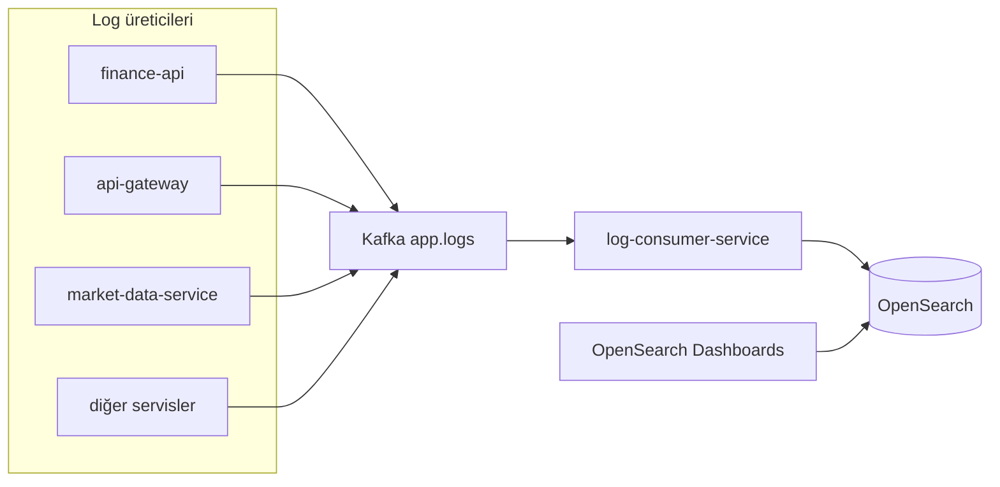
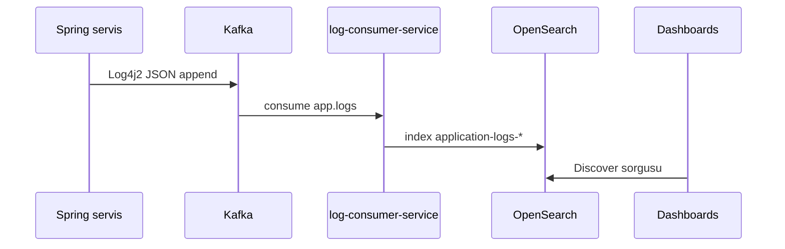

# log-consumer-service

## Özet

**log-consumer-service**, tüm Spring backend servislerinin Log4j2 ile Kafka’ya yazdığı **`app.logs`** topic’ini tüketir ve olayları **OpenSearch**’te `application-logs-*` indekslerine yazar. Index template ve ISM retention policy’yi bootstrap eder; operasyon için internal metrik API sunar.

## Sorumluluklar

- `app.logs` Kafka consumer (`AppLogsKafkaConsumer`)
- JSON log parse; `correlationId` header → MDC
- OpenSearch indeksleme ve hata metrikleri
- ISM retention (`OPENSEARCH_LOG_RETENTION_DAYS`, varsayılan 30 gün)
- Malformed JSON skip; DLQ publish (`topic.dlq`)
- Internal özet: `GET /internal/system-intelligence`

## Sorumluluk dışı

- Uygulama log formatı üretimi — her servisin `log4j2-spring.xml`
- Log arama UI — OpenSearch Dashboards ([observability.md](../observability.md))
- İş domain API — finance-api vb.
- Metrik scrape toplama — Prometheus (ayrı pipeline)

## Yapılabilecekler

| Perspektif | Yetenek |
|------------|---------|
| Operasyon | Merkezi log arama (Dashboards), Kafka lag izleme |
| Geliştirici | `traceId` / `service` ile hata ayıklama |
| SRE | Grafana log pipeline panelleri, DLQ oranı |

## Çalışma ortamı

| Özellik | Değer |
|---------|-------|
| Maven modülü | `log-consumer-service` |
| Container adı | `log-consumer-service` |
| HTTP port | **8087** |
| Compose bağımlılığı | `opensearch` **healthy** |

## Bağımlılıklar

| Bileşen | Kullanım |
|---------|----------|
| PostgreSQL | Hayır |
| Kafka | `app.logs` tüketir |
| OpenSearch | HTTPS, `admin` / `123456789` (demo) |
| Keycloak | Hayır |

## Bağlam diyagramı



## HTTP veri akışları

| Path | Açıklama |
|------|----------|
| `/actuator/health` | Health |
| `/actuator/prometheus` | Metrikler |
| `/internal/system-intelligence` | Kafka lag, failed/skipped/DLQ özeti |

Portal trafiği bu servise **yönlendirilmez**.

## Kafka / olay akışları

| Topic | Rol | Açıklama |
|-------|-----|----------|
| `app.logs` | Tüketir | JSON log satırları |
| `{topic}.dlq` | Üretir (hata) | İşlenemeyen mesajlar |

### Log pipeline



Log JSON alanları (ör.): `@timestamp`, `level`, `message`, `service`, `traceId`, `correlationId`, `stack_trace` — [`log4j2-kafka-template.json`](../../../finance-api/src/main/resources/log4j2-kafka-template.json).

## Zamanlayımlar / arka plan işleri

| Bileşen | Görev |
|---------|-------|
| `OpenSearchLogInfrastructureBootstrap` | Startup’ta index template + ISM policy |
| Kafka listener | Sürekli consume |

## Veri modeli

OpenSearch indeksleri (relational Flyway yok).

| Öğe | Değer |
|-----|-------|
| İndeks öneki | `application-logs` (`OPENSEARCH_INDEX_PREFIX`) |
| ISM policy | `application-logs-retention` |
| Volume | `docker_opensearch_data` |

## Paket / kod yapısı

```
log-consumer-service/src/main/java/com/company/logconsumer/
├── ingestion/kafka/       # AppLogsKafkaConsumer
├── ingestion/opensearch/  # Indexer, bootstrap
├── intelligence/http/     # SystemIntelligenceController
└── bootstrap/config/      # KafkaConsumerConfig
```

## Yapılandırma

| Değişken | Açıklama |
|----------|----------|
| `APP_LOGS_TOPIC` | Varsayılan `app.logs` |
| `LOG_CONSUMER_GROUP_ID` | Consumer group |
| `OPENSEARCH_HOST` / `PORT` / `SCHEME` | Cluster bağlantısı |
| `OPENSEARCH_USERNAME` / `PASSWORD` | Security |
| `OPENSEARCH_LOG_RETENTION_DAYS` | ISM silme süresi |

Tam liste: [configuration.md](../configuration.md).

## Gözlemlenebilirlik

| Kanal | Detay |
|-------|-------|
| Metrikler | `kafka_events_processed_total`, `kafka_events_opensearch_failed_total`, `kafka_events_dlq_published_total` |
| Prometheus job | `log-consumer-service` |
| Grafana | Finance Platform Overview — log pipeline panelleri |

Dashboards ilk kurulum: `application-logs-*` index pattern — [observability.md](../observability.md).

## Yerel çalıştırma

```bash
cd Docker && docker compose up -d kafka opensearch
export KAFKA_BOOTSTRAP_SERVERS=localhost:9092

mvn -pl log-consumer-service -am spring-boot:run
```

Port **8087**. OpenSearch healthy olmalı.

Kurulum: [getting-started.md](../getting-started.md).

## İlgili belgeler

| Belge | İçerik |
|-------|--------|
| [observability.md](../observability.md) | Dashboards, retention, sorun giderme |
| [architecture.md](../architecture.md) | Platform log akışı |
| Tüm servis MD’leri | Log üretici olarak `app.logs` |
