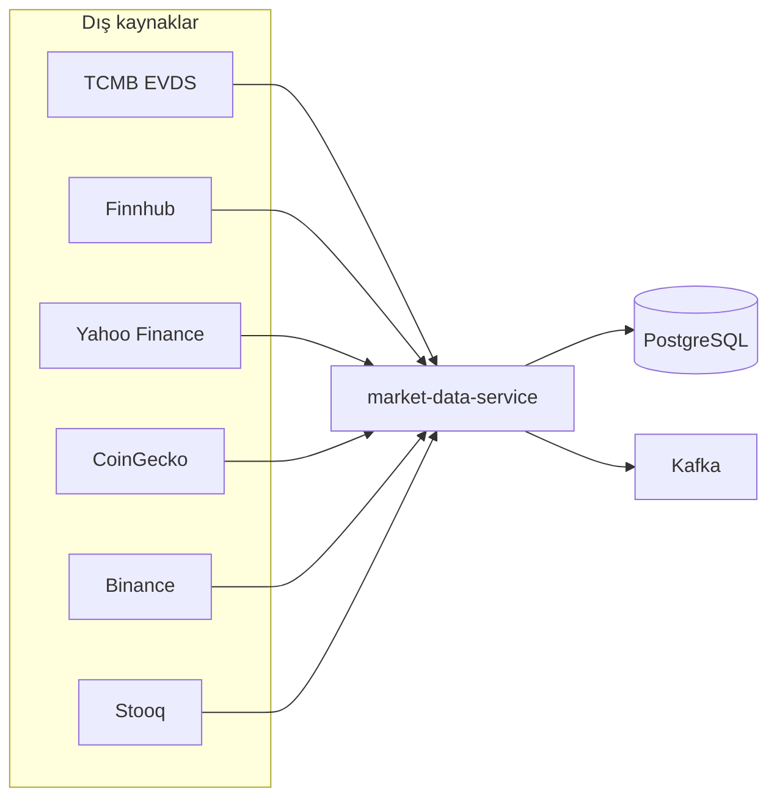
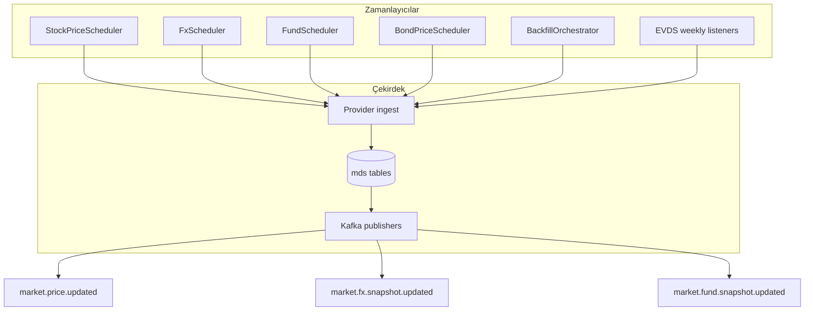
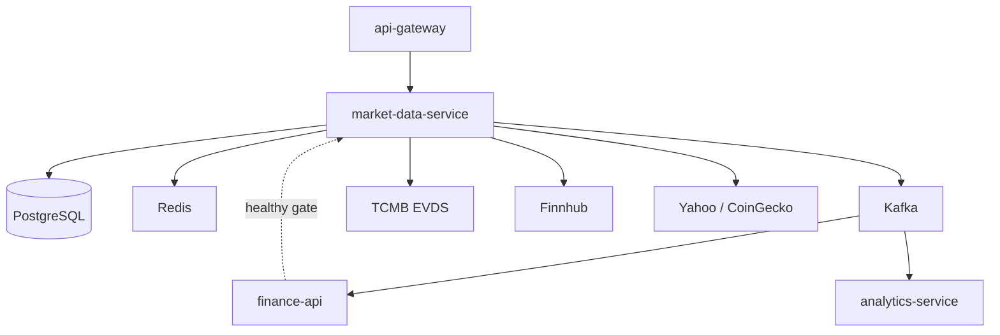
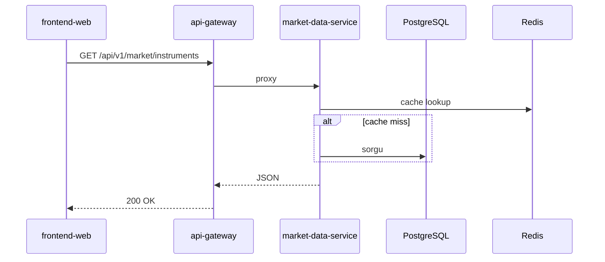
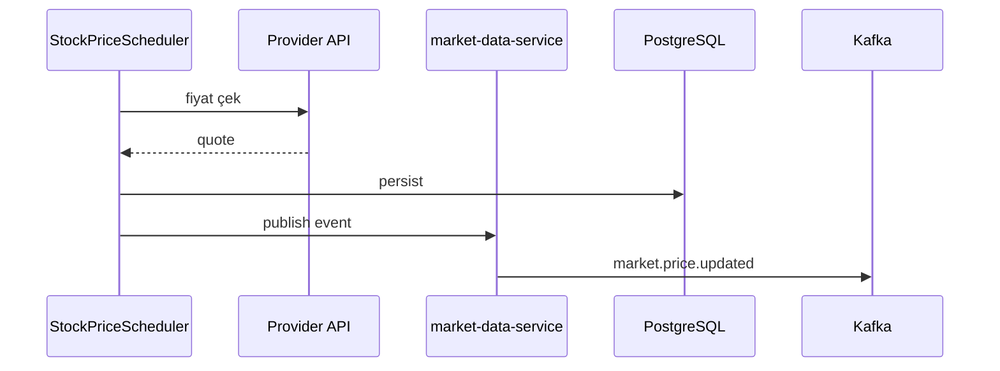

# market-data-service

## Özet

**market-data-service (MDS)**, platformun **piyasa verisi motorudur**. Enstrüman kataloğunu yönetir; harici sağlayıcılardan (TCMB EVDS, Finnhub, Yahoo, CoinGecko, Binance vb.) canlı ve geçmiş fiyat çeker; scheduler’larla periyodik günceller. Fiyat değişimlerini Kafka topic’lerine yayınlayarak `finance-api` ve `analytics-service`’i besler.

## Sorumluluklar

- BIST, Nasdaq, kripto, fon, döviz, tahvil, eurobond enstrüman kataloğu
- Canlı fiyat scheduler’ları (hisse, FX, tahvil, fon NAV, kripto)
- Geçmiş fiyat backfill ve gap repair
- TCMB EVDS: politika faizi, repo, TL mevduat, tahvil serileri, CPI
- REST API: `/api/v1/market/**`, `/api/v1/rates/**` (gateway üzerinden)
- Kafka: `market.price.updated`, FX ve fon snapshot topic’leri
- Redis / hibrit cache ile sık okunan uçların hızlandırılması

## Sorumluluk dışı

- Kullanıcı portföyü ve işlem — `finance-api`
- Portal JWT / admin — `api-gateway` + `finance-api`
- Teknik RSI / insight hesaplama — `analytics-service`
- Haber RSS — `news-service`
- E-posta — `notification-service`

## Yapılabilecekler

| Perspektif | Yetenek |
|------------|---------|
| Portal (dolaylı) | Piyasa listeleri, grafik verisi, banka kurları, faiz kartları veri kaynağı |
| API tüketicisi | Enstrüman listeleme, geçmiş seri, oranlar, fundamentals |
| Operasyon | Ingestion status, provider health, debug uçları |
| Platform | Kafka ile gerçek zamanlı fiyat yayını |

## Çalışma ortamı

| Özellik | Değer |
|---------|-------|
| Maven modülü | `market-data-service` |
| Container adı | `market-data-service` |
| HTTP port (Docker) | **8080** (internal) |
| HTTP port (yerel `dev`) | **8082** |
| Spring profilleri | `dev` (H2), `docker` (PostgreSQL) |
| Compose bağımlılığı | `finance-api` **healthy** sonrası start |

## Harici sağlayıcı haritası



## Scheduler pipeline (özet)



## Bağımlılıklar

| Bileşen | Kullanım |
|---------|----------|
| PostgreSQL | Docker: `finance` DB; dev: H2 bellek |
| Redis | Fiyat / katalog cache |
| Kafka | Fiyat ve snapshot publish |
| HTTP dış | TCMB EVDS, Finnhub, Yahoo, CoinGecko, Binance, Stooq vb. |
| HTTP iç | `finance-api` (bootstrap / katalog senkron) |

## Bağlam diyagramı



## HTTP veri akışları

### Controller’lar

| Controller | Path (gateway) | Açıklama |
|------------|----------------|----------|
| `MarketDataController` | `/api/v1/market/**` | Enstrüman, spot fiyat, katalog |
| `RatesController` | `/api/v1/rates/**` | Politika faizi, repo, TL mevduat |
| `MarketHistoryController` | `/api/v1/market/.../history` | Geçmiş seriler |
| `MarketFundamentalsController` | fundamentals | Temel veri |
| `IngestionStatusController` | internal/status | Backfill ilerlemesi |
| `ProviderHealthController` | health | Sağlayıcı durumu |

### Okuma isteği



## Kafka / olay akışları

Kaynak: [`MarketDataTopics.java`](../../../market-data-service/src/main/java/com/company/marketdataservice/shared/kafka/MarketDataTopics.java).

| Topic | Üreten | Tüketici (ör.) | İçerik |
|-------|--------|----------------|--------|
| `market.price.updated` | MDS | finance-api, analytics-service | Spot fiyat güncellemesi |
| `market.fx.snapshot.updated` | MDS | finance-api | FX snapshot |
| `market.fund.snapshot.updated` | MDS | finance-api | TEFAS NAV snapshot |

### Scheduler → Kafka



## Zamanlayıcılar / arka plan işleri

| Bileşen | Tetikleme | Görev |
|---------|-----------|-------|
| `StockPriceScheduler` | `scheduler.stock.delay-ms` (~30s demo) | Hisse fiyatları |
| `FxScheduler` | `scheduler.fx.delay-ms` (~5 dk) | Döviz |
| `FundScheduler` | fixed delay | TEFAS NAV |
| `BondPriceScheduler` | `scheduler.bond.delay-ms` | Tahvil |
| `BondHistoryRefreshScheduler` | cron (İstanbul) | Tahvil geçmiş |
| `BackfillOrchestrator` | startup + scheduled | Geçmiş fiyat backfill |
| `MetalSpotHistoryBootstrapper` | delayed | Emtia geçmiş |
| `PolicyRateWeeklyBootstrapListener` | haftalık cron | EVDS politika faizi |
| `RepoRateBootstrapListener` | haftalık cron | Repo oranı |
| `TlDepositWeeklyBootstrapListener` | haftalık cron | TL mevduat |
| `CpiMonthlyBootstrapListener` | aylık cron | TÜFE |
| `TefasNavHistoryGapRepairScheduler` | günlük | Fon NAV gap |
| `TrGovUsdEurobondHistoryRefreshScheduler` | cron | Eurobond geçmiş |
| `SharesOutstandingWeeklyScheduler` | haftalık | Hisse adet doğrulama |

İlk stack açılışında backfill **~30 dakika** sürebilir — [getting-started.md](../getting-started.md).

## Veri modeli

| Öğe | Değer |
|-----|-------|
| Flyway | `market-data-service/src/main/resources/db/migration/` |
| History tablosu | `mds_flyway_schema_history` |
| Ana kavramlar | enstrüman eşlemeleri, `mds_market_price_history`, EVDS oran noktaları, provider mapping |

**Dev profili:** H2 bellek — production verisi yok. Docker’da PostgreSQL `finance` DB paylaşılır.

## Paket / kod yapısı

```
market-data-service/src/main/java/com/company/marketdataservice/
├── spot/           # Canlı fiyat, MarketDataController
├── history/        # Backfill, geçmiş seri
├── rates/          # EVDS oranları, RatesController
├── fund/           # TEFAS NAV
├── fx/             # Döviz snapshot
├── bond/           # Tahvil
├── eurobond/       # TR USD eurobond
├── fundamentals/   # Temel veri
├── shared/kafka/   # MarketDataTopics, publisher'lar
└── bootstrap/      # Startup, health
```

## Yapılandırma

| Değişken | Açıklama |
|----------|----------|
| `TCMB_API_KEY` / `MARKET_EVDS_API_KEY` | EVDS (boş `KEY=` yazmayın) |
| `FINNHUB_API_KEY` | Nasdaq / hisse |
| `MARKET_HISTORY_BACKFILL_*` | Backfill davranışı |
| `scheduler.*.delay-ms` | Demo rate-limit uyumlu aralıklar |
| `SPRING_DATASOURCE_URL` | Docker PostgreSQL |
| `KAFKA_BOOTSTRAP_SERVERS` | Kafka |

Tam liste: [configuration.md](../configuration.md).

## Gözlemlenebilirlik

| Kanal | Detay |
|-------|-------|
| Loglar | `app.logs` |
| Metrikler | Prometheus job `market-data-service` |
| Trace | OTLP → Jaeger |

İzleme: `docker compose logs -f market-data-service`

Ayrıntı: [observability.md](../observability.md).

## Yerel çalıştırma

```bash
mvn -pl market-data-service -am spring-boot:run -Dspring-boot.run.profiles=dev
```

Port **8082**. Gerçek EVDS/Finnhub için anahtarları `application-dev.yml` veya env ile verin.

Kurulum: [getting-started.md](../getting-started.md) · Geliştirme: [development.md](../development.md).

## İlgili belgeler

| Belge | İçerik |
|-------|--------|
| [finance-api.md](finance-api.md) | BFF ve Kafka tüketici |
| [analytics-service.md](analytics-service.md) | Fiyat olayı tüketici |
| [api-gateway.md](api-gateway.md) | `/api/v1/market/**` route |
| [architecture.md](../architecture.md) | Platform akışı |
