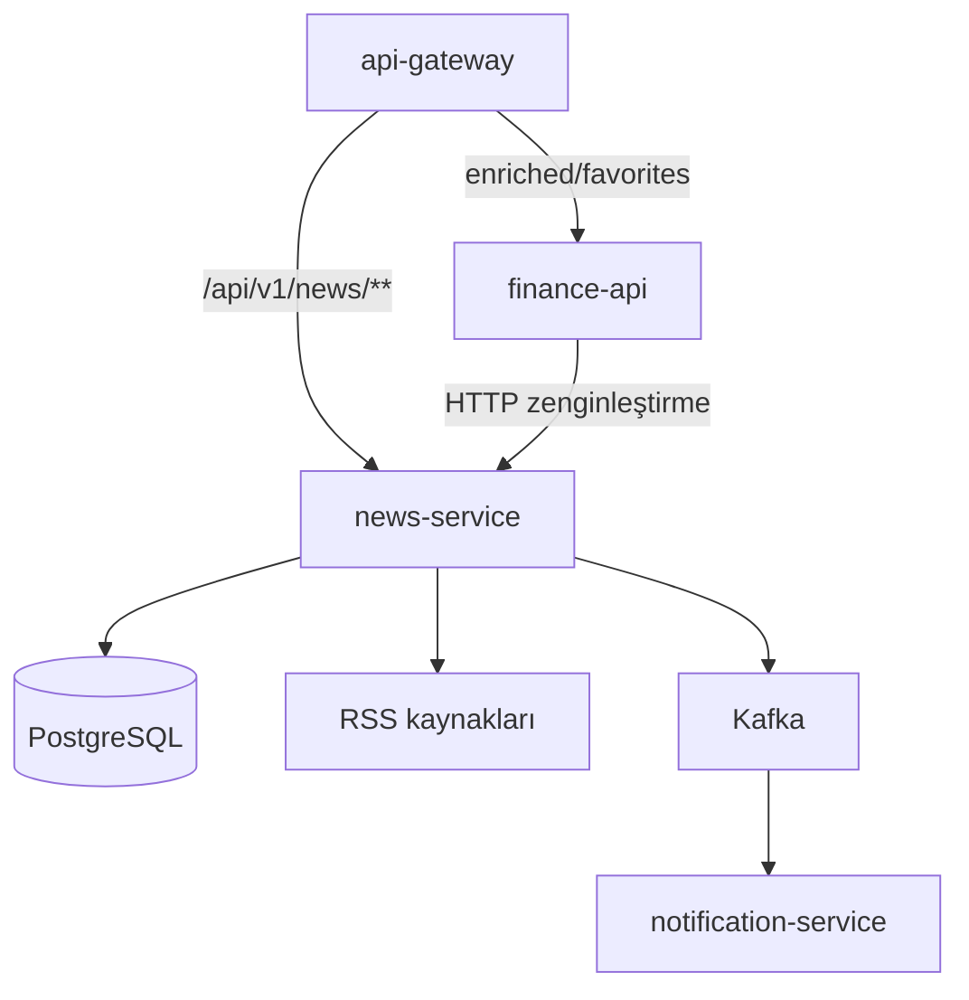
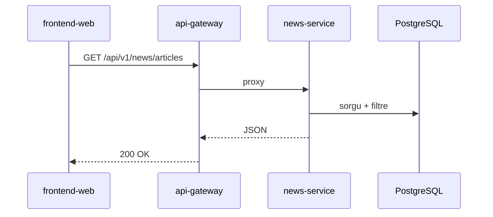
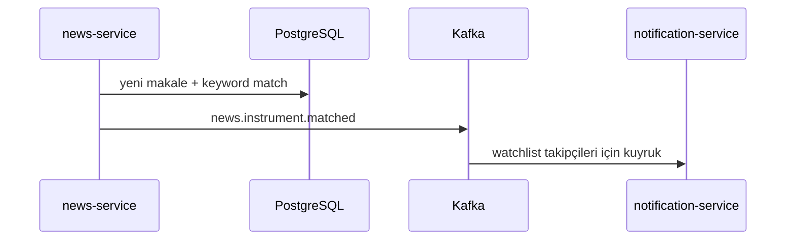
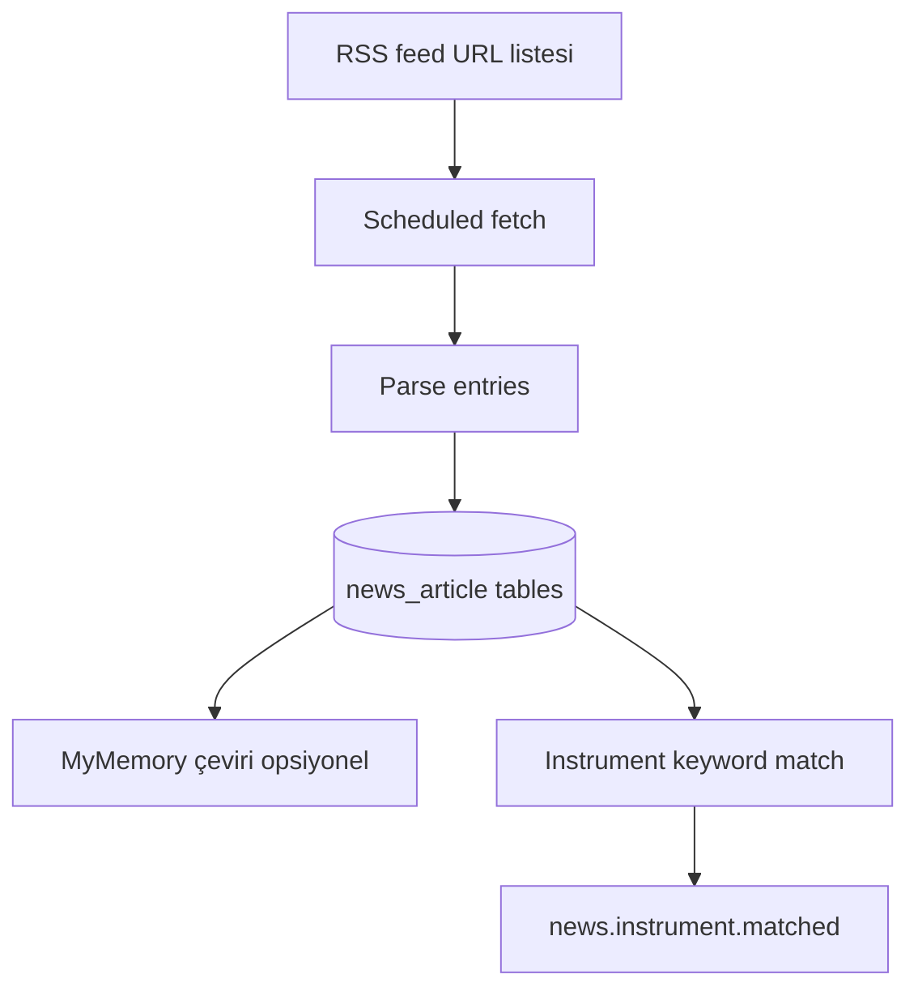

# news-service

## Özet

**news-service**, finans **haber akışını** yönetir: tanımlı RSS kaynaklarını periyodik olarak tarar, makaleleri PostgreSQL’e yazar, isteğe bağlı MyMemory ile çevirir ve ham haber REST API’sini sunar. Enstrüman anahtar kelime eşleşmesi sonrası `news.instrument.matched` olayını Kafka’ya yayınlar.

## Sorumluluklar

- RSS ingestion (zamanlanmış görevler)
- Haber saklama, filtreleme, listeleme API (`NewsController`)
- Çok dilli çeviri (MyMemory)
- Enstrüman–haber eşleştirme ve Kafka event üretimi
- Admin haber metrikleri (`AdminNewsMetricsController`)

## Sorumluluk dışı

- Haber favorileri ve zenginleştirilmiş portal görünümü — `finance-api` (`/api/v1/news/enriched/**`)
- Kullanıcı portföyü — `finance-api`
- E-posta — `notification-service` (`news.instrument.matched` tüketir)
- Piyasa fiyatı — `market-data-service`

## Yapılabilecekler

| Perspektif | Yetenek |
|------------|---------|
| Portal (dolaylı) | Haber listesi, filtre, çeviri (gateway → news veya finance BFF) |
| Admin | Haber kaynak KPI |
| Platform | İzleme listesi ile ilişkili haber bildirimi tetikleme |

## Çalışma ortamı

| Özellik | Değer |
|---------|-------|
| Maven modülü | `news-service` |
| Container adı | `news-service` |
| HTTP port | **8082** |
| Docker güvenlik | `read_only` root FS, `tmpfs` `/tmp`, `cap_drop: ALL` |
| Zorunlu env | `NEWS_DB_PASSWORD` (`Docker/.env`) |

## Bağımlılıklar

| Bileşen | Kullanım |
|---------|----------|
| PostgreSQL | `finance` DB (`DB_HOST`, `DB_*`) |
| Kafka | `news.instrument.matched` üretir; `app.logs` |
| HTTP dış | RSS feed URL’leri |
| MyMemory | Çeviri API (opsiyonel e-posta ile kota) |

## Bağlam diyagramı



## HTTP veri akışları

### Route ayrımı

| Path | Hedef servis |
|------|----------------|
| `/api/v1/news/**` (ham) | news-service |
| `/api/v1/news/enriched/**`, `.../favorites/**` | finance-api |

### Haber listesi



## Kafka / olay akışları

| Topic | Rol | Açıklama |
|-------|-----|----------|
| `news.instrument.matched` | Üretir | Haber ↔ enstrüman eşleşmesi |
| `app.logs` | Üretir | Log4j2 |

Kaynak: [`KafkaTopicNames.java`](../../../news-service/src/main/java/com/company/newsservice/bootstrap/config/kafka/KafkaTopicNames.java).



## RSS ingestion pipeline



## Zamanlayıcılar / arka plan işleri

| Bileşen | Görev |
|---------|-------|
| RSS ingestion scheduler | Feed’leri periyodik çekme |
| Çeviri / görsel backfill job’ları | `NEWS_IMAGE_*`, translation yapılandırması |

Timeout’lar: `NEWS_RSS_CONNECT_TIMEOUT_MS`, `NEWS_RSS_READ_TIMEOUT_MS`.

## Veri modeli

| Öğe | Değer |
|-----|-------|
| Flyway | `news-service/src/main/resources/db/migration/` |
| Ana kavramlar | `news_article`, çeviriler, topic tag’ler, related symbols |

## Paket / kod yapısı

```
news-service/src/main/java/com/company/newsservice/
├── query/            # NewsController
├── ingestion/        # RSS pipeline
├── admin/            # AdminNewsMetricsController
└── bootstrap/        # config, kafka, health
```

## Yapılandırma

| Değişken | Açıklama |
|----------|----------|
| `NEWS_DB_PASSWORD` | PostgreSQL (compose zorunlu) |
| `NEWS_RSS_*` | Timeout, user-agent, max entries |
| `NEWS_TRANSLATION_MYMEMORY_EMAIL` | Çeviri kotası |
| `news.instrument.keywords` | Sembol ↔ anahtar kelime eşlemesi |

Tam liste: [configuration.md](../configuration.md).

## Gözlemlenebilirlik

| Kanal | Detay |
|-------|-------|
| Loglar | `app.logs` |
| Metrikler | Prometheus job `news-service` |

Ayrıntı: [observability.md](../observability.md).

## Yerel çalıştırma

```bash
# Postgres + Kafka (Docker) ayakta olmalı
mvn -pl news-service -am spring-boot:run
```

Port **8082** — `market-data-service` dev ile aynı host portunda **çalıştırmayın**.

Kurulum: [getting-started.md](../getting-started.md).

## İlgili belgeler

| Belge | İçerik |
|-------|--------|
| [finance-api.md](finance-api.md) | Enriched / favorites BFF |
| [notification-service.md](notification-service.md) | Matched haber tüketici |
| [api.md](../api.md) | Gateway news route |
