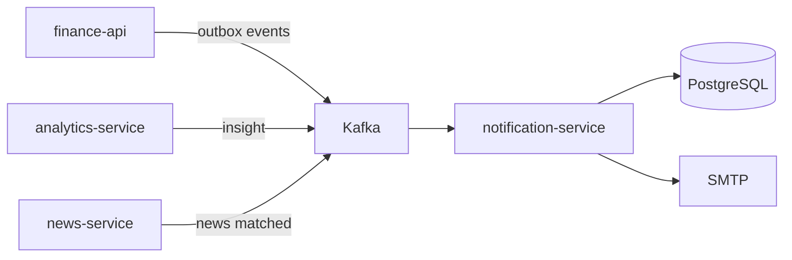
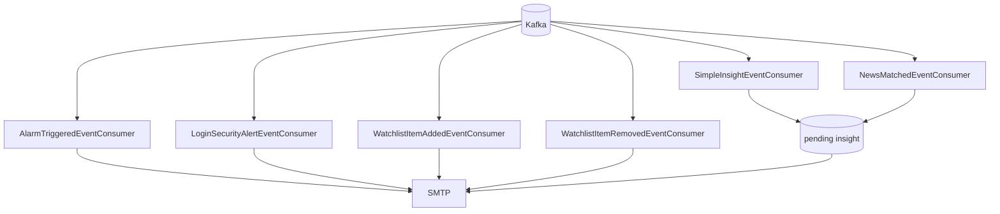
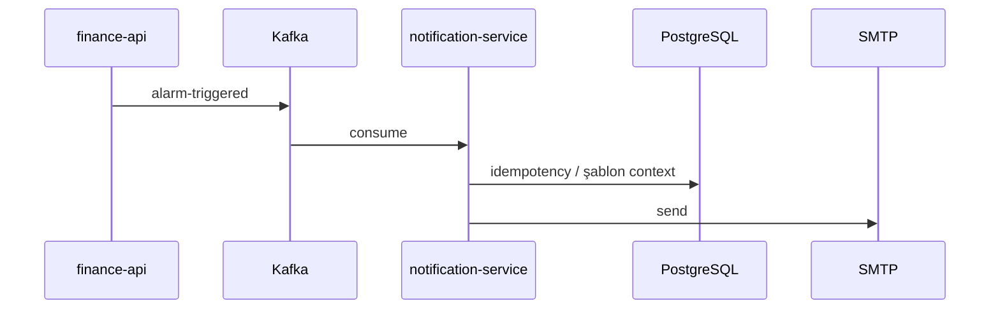

# notification-service

## Özet

**notification-service**, platformdaki **asenkron bildirim kanalıdır**. Kafka domain olaylarını dinler ve SMTP ile şablonlu e-posta gönderir. Portal trafiği için ana API yüzeyi yoktur; iş akışları olay güdümlüdür.

## Sorumluluklar

- Alarm tetiklenmesi e-postası (`alarm-triggered`)
- Giriş güvenlik uyarısı (`login-security.alert`)
- İzleme listesi ekleme/çıkarma bildirimi
- Analytics basit insight (`analytics.insight.simple`)
- Haber–enstrüman eşleşmesi (`news.instrument.matched`) — watchlist takipçileri
- Kafka retry ve DLQ (`{topic}.dlq`) yönetimi
- Pending insight / dedup tabloları (PostgreSQL)

## Sorumluluk dışı

- Alarm koşulu değerlendirme — `finance-api`
- Fiyat verisi — `market-data-service`
- Haber ingestion — `news-service`
- JWT / gateway — `api-gateway`

## Yapılabilecekler

| Perspektif | Yetenek |
|------------|---------|
| Portal kullanıcısı | Alarm, watchlist, güvenlik ve insight e-postaları almak |
| Operasyon | SMTP yapılandırması, consumer lag, health |
| Geliştirici | Kafka event sözleşmelerini test etmek |

## Çalışma ortamı

| Özellik | Değer |
|---------|-------|
| Maven modülü | `notification-service` |
| Container adı | `notification-service` |
| HTTP port | **8086** |
| Spring profilleri | `docker` |
| Mail health | `MANAGEMENT_HEALTH_MAIL_ENABLED=false` (Docker) |

## Bağımlılıklar

| Bileşen | Kullanım |
|---------|----------|
| PostgreSQL | Pending insight, dedup state |
| Kafka | Tüm inbound topic’ler |
| SMTP | Gmail veya özel `SMTP_*` |
| Keycloak | Hayır (doğrudan) |

## Bağlam diyagramı



## HTTP veri akışları

Portal senkron API **yok**. Gateway’de `notification-base-uri` tanımlıdır; OpenAPI diagnostic path’ler `/services/notification/...` altında — [api.md](../api.md).

Internal/diagnostic HTTP minimal; ana yüzey Kafka consumer’lardır.

## Kafka / olay akışları

### Tüm tüketiciler (görsel)



Kaynak: [`KafkaTopicNames.java`](../../../notification-service/src/main/java/com/company/notification/bootstrap/config/kafka/KafkaTopicNames.java).

| Topic | Üreten | Consumer sınıfı |
|-------|--------|------------------|
| `alarm-triggered` | finance-api | `AlarmTriggeredEventConsumer` |
| `login-security.alert` | finance-api | `LoginSecurityAlertEventConsumer` |
| `watchlist.item.added` | finance-api | `WatchlistItemAddedEventConsumer` |
| `watchlist.item.removed` | finance-api | `WatchlistItemRemovedEventConsumer` |
| `analytics.insight.simple` | analytics-service | `SimpleInsightEventConsumer` |
| `news.instrument.matched` | news-service | `NewsMatchedEventConsumer` |

### Alarm e-postası



### DLQ

İşleme hatalarında mesaj `{originalTopic}.dlq` partition’ına yönlendirilir (`KafkaConsumerConfig`).

## Zamanlayıcılar / arka plan işleri

Tamamen event-driven; periyodik job yok (pending insight flush consumer içi tetiklenir).

## Veri modeli

| Öğe | Değer |
|-----|-------|
| Flyway | `notification-service/src/main/resources/db/migration/` |
| Ana kavramlar | `pending_insight_events`, delivery dedup, alarm şablon state |

## Paket / kod yapısı

```
notification-service/src/main/java/com/company/notification/
├── alarm/            # AlarmTriggeredEventConsumer
├── watchlist/        # Watchlist consumers
├── security/         # LoginSecurityAlertEventConsumer
├── insight/          # Insight + NewsMatched consumers
└── bootstrap/config/kafka/
```

## Yapılandırma

| Değişken | Açıklama |
|----------|----------|
| `SMTP_USERNAME` / `SMTP_PASSWORD` | Gönderen hesap |
| `NOTIFICATION_MAIL_FROM` | From adresi |
| `APP_PORTAL_PUBLIC_URL` | E-posta linkleri (`http://localhost:5173`) |
| `KAFKA_BOOTSTRAP_SERVERS` | Kafka |
| `SPRING_DATASOURCE_URL` | PostgreSQL |

Tam liste: [configuration.md](../configuration.md).

## Gözlemlenebilirlik

| Kanal | Detay |
|-------|-------|
| Loglar | `app.logs` |
| Metrikler | Prometheus job `notification-service` |
| Grafana | Log pipeline panelleri (dolaylı) |

Ayrıntı: [observability.md](../observability.md).

## Yerel çalıştırma

```bash
export KAFKA_BOOTSTRAP_SERVERS=localhost:9092
mvn -pl notification-service -am spring-boot:run
```

Port **8086**. SMTP için `.env` veya compose demo Gmail.

Kurulum: [getting-started.md](../getting-started.md).

## İlgili belgeler

| Belge | İçerik |
|-------|--------|
| [finance-api.md](finance-api.md) | Outbox üretici |
| [analytics-service.md](analytics-service.md) | Insight üretici |
| [news-service.md](news-service.md) | News matched üretici |
| [architecture.md](../architecture.md) | Kafka özeti |
